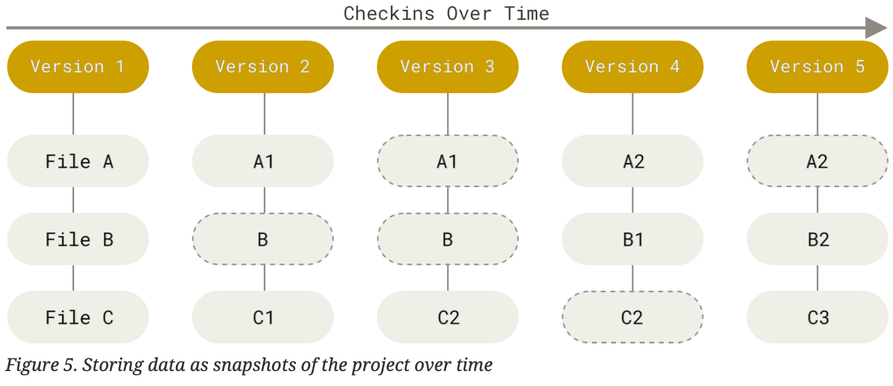

## 1 What is Git?

### 1.1 Version Control System (VCS)
A system that records chages to a file or set of files over time so that you can recall specific versions later.

1. Local VCS: A database that keeps all the changes to files under revision control.

2. Certralized VCS: A single sever that contains all the versioned files, and a number of clients that check out files from that central place.

3. Distributed VCS: Every clone is a full backup of all the data(that is, the entire repository, including its full history)

### 1.2 Data Storage
#### Other Systems: a list of file-based changes
Delta(difference)-based Version Control: a set of files (base) and the changes made to each file over time.

#### Git: a series of snapshot of a miniature filesystem
Streams of Snapshots: Takes a picture of what all files look like at the moment and stores a reference to that snapshot.

### 1.3 Integrity
Everything in Git is checksumed before it is stored and is then refered to by that checksum.

> Checksum: A checksum is a value that represents the number of bits in a transmission message and is used by IT professionals to detect high-level errors within data transmissions. Prior to transmission, every piece of data or file can be assigned a checksum value after running a cryptographic hash function.

SHA-1 hash: a 40-character strign composed of hexadecimal characters, which is calculated based on the contents of a file or directory structure in Git.

Git stores everything in its database not by file name but by the hash value of its contents.

### 1.4 The Three States of Files
- ***Modified***: you have changed the file but not commit it to your database yet.
- ***Staged***: you have marked a modified file in its current version to go into your next commit snapshot.
- ***Commited***: you have stored the file safely in your local database.

### 1.5 Composition of a Git Project
- ***Working Directory***: A single snapshot of one version of the project, pulled out of the compressed database in the Git directory and place on your disk for you to use or modify.
- ***Staging Area***: A file contained in Git directory, stores information about what will go into your next commit.
- ***Git Directory***: A directory called `.git` stores metadata and object database. This is copied when you clone a repository from another computer.

## 2. Git Setup
