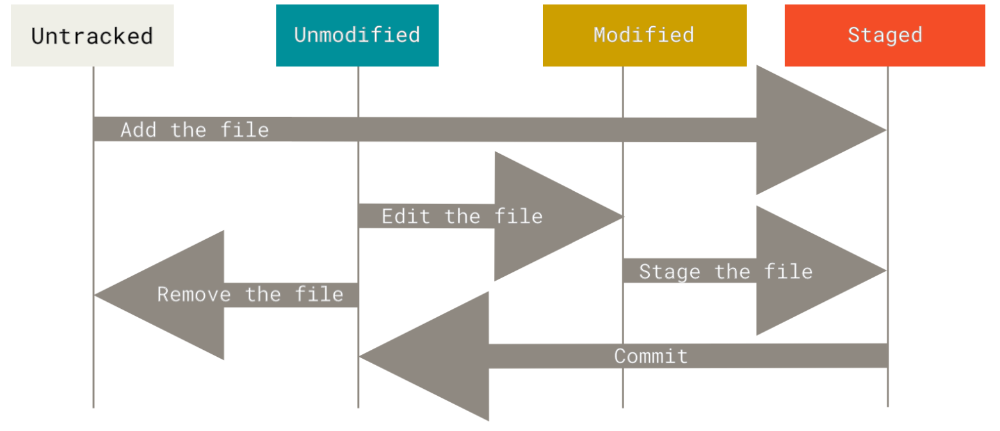

## 1. Getting a Git Repository

### 1.1 Initialize
Turn a local directory that is currently not under version control into a Git repository:
> `$ git init`

Creates a new subdirectory named `.git`, a Git repository skeleton.

If `.` is an empty directory, try a initial commit:
> `$ git commit -am "Initial Commit"`

### 1.2 Clone
Clone an existing Git repository from elsewhere:
>  `$ git clone <url> repo-name`

Git receives a **full copy** of nearly all data that the sever has, instead just a working copy. **Every version of every file** for the history of the project is pulled down by default.

Git initialize a `.git` directory as well, checking out to the latest version.    

#### Transfer Protocol
- `https://github.com/username/repository`
- SSH: `user@server:path/to/repo.git`

## 2. Recording Changes to the Repository
### 2.1 File Status
Checking the Status of Files:
> `$ git status`

* Tracked (modified, unmodified, staged)
    * Newly staged
    * In the last snapshot
* Untracked

#### Short Status
> `$ git status -s`
> `$ git status --short`

Two columns to the output:
- left-hand column: the status of the staging area.
- right-hand: the status of the working tree

`??`: Untracked
`A`: New files added to the staging area
`M`: Modified files

For example: `MM` means modified, staged, and modified again.

### 2.2 Add to the next commit
> `$ git add <path-name>`
1. Tracking New Files: Add the untracked file or directory to Staging Area.
2. Staging modified files.
3. Marking merge-conflicted files as resolved.

If you modify a file after running `git add`, you have to run it again to stage the latest version of the file.

### 2.3 Ignore Files
Prevent Git to automatically add or even show as being untracked:
> `$ vim .gitignore`
#### Rules for Patterns
- Blank lines or lines starting with `#` are ignored.
- Standard glob patterns work recursively.
    - `*`: zero or more characters
    - `[]`: any single character inside the sqare bracket
    - `?`: single character
    - `**`: nested directories (`a/**/z` matches `a/z, a/b/z, a/b/c/z ...`)
- Start patterns with `/` to avoid revursivity.
- End patterns with `/` to specify a directory.
- Negate patterns by strating with `!`.

Checkout examples at https://github.com/github/gitignore

#### Rules for Application
Applies recursively to the files under the directory where `.gitignore` are located.
You can have multiple `.gitignonre` files in both root directory of a repository or any subdirectories. 

### 2.4 View Changes
To see what you've changed yet not staged (compares what is in working directory to what is in staging area):
> `$ git diff`

If all chages are staged, `git diff` would give no output.

To see what you've staged that will go into next commit (compares staged changes to last commit):
> `$ git diff --staged`
> `$ git diff -cached`

#### External Tools
> `$ git difftool`

Run `git difftool --tool-help` to see what tool is available on your machine.

### 2.5 Commit Changes
> `$ git commit`
> `$ git commit -v`                     # put the diff of changes in the editor
> `$ git commit -m "Commit Message"`    # type commit message inline
> `$ git commit -am "Commit Message"`   # skip the staging area i.e. automatically stage all files that are already tracked before doing commit

#### Lauch Editor of Choice:
- `$ echo "export EDITOR='vim'" ~/.zshrc` to set shell's EDITOR environment variable.
- `$ git config --global core.editor=vim`

The default commit message contains the latest output of `git status` command commented out and one empty line on the top.

#### Git Commit Output Explanation:
> [Branch SHA-1 Checksum] Commit Message
> how many files are changes, statistics about lines added and removed

### 2.6 Remove Files
Remove file in the working directory and stage the removal:
> `$ git rm ` 
> `$ git rm -f `    # force the removal if file is modified or staged
> `$ git rm --cached`   # keep the file in working directory but remove it from staging area if the file is already staged

### 2.7 Move Files
Rename a file in Git:
> `$ git mv file_from file_to`

which is eqivalent to (Git figures out it's a rename inplicitly):
> `$ mv file_from file_to`
> `$ git rm file_from`
> `$ git add file_to`

## 3. Viewing the Commit History
List commits in reverse chronological order:
> `$ git log`
> 
> commit SHA-1 Checksum
> Author: Name Email
> Date: .....
>
>   Commit Message
### 3.1 Formatting Options fot `git log`
| Options | Results |
| :-: | :-: |
| `-p, --patch` | show the difference introduced in each commit|
| `--stat` | abbreviated stats of a list of modified files |
| `--graph` | add an ASCII graph showing branch and merge history |
| `--abbrev-commit` | show the first few characters of SHA-1 checksum |
| `--oneline` | shorthand for `--pretty=oneline --abbrev-commit` |
| `--relative-date` | display the date in a relative format instead of the full date format|
| `--pretty` | change the log output to formats other than the default |
| | **Option Values** |
| | `oneline`: print commits on a single line |
| | `short, full, fuller`: less or more information |
| | `format: "%a %b"`: specify your own log output format |

### 3.2 Filtering Options for `git log`
| Options | Results |
| :-: | :-: |
| `-n #, -#` | limit the number of log entries to # |
| `--since, --after; --before, --until` | option values can be `YYYY-MM-DD, X year(s), X day(s) X minute(s) ago`|
| `--no-merges` | ignore merge commits |
| `--author="Jason Wu"` | filter a specific author |
| `--grep` | search for keywords in the commit messages |
| `--all-match` | limit the output to just those commits that match _all_ `--grep` patterns | 
| `-S` | take a string and shows only those commits that changed the number of occurrences of that string |
| `-- path/to/file` |  show commits that certain files are changed (always the last option to separate the paths from the options)

## 4. Undoing Things
### 4.1 Redo Commits
When you commit too early (forget to add some files, or mess up with commit message) :
> `$ git commit --amend`    # takes staging area for the commit and overwrite previous commit

- End up with a single commit -- the first commit was **replaced** with the second commit, a brand new and improved commit, as the previous commit disappeared.
- Make minor imporvements to last commit, without cluttering repository history.
- _**Only amend commits that are still local before pushing**_.

### 4.2 Unstage Files
Unstage files from staging area to working directory:
> `$ git restore --staged <file>`

### 4.3 Unmodify Files
Unmodify modified files (revert back to the version of latest commit):
> `$ git restore <file>`
! This is a dangerous command, any local changes are gone -- Git replaced the file with the last staged or commited version.

## 5. Working with Remotes
Remote repositories are **versions of projects** hosted:
- On the Internet or network
- On your local machine

### 5.1 Show Remotes
See remote servers you've configured:
> `$ git remote`    # lists the shortnames of each remote handle you've specified (`origin` is the default name of server you cloned from)
> `$ git remote -v` # shows URLs stored for the shortnames to be used for reading and writing.

### 5.2 Add Remotes
Implicitly:
> `$ git clone <url>` # automatically adds that repository under the name **origin**. 

Explicitly:
> `$ git remote add <shortname> <url>`  # **shortname** can be used on the command line in lieu of the whole URL.

### 5.3 Fetch and Pull from Remotes
Get data from remote projects ( pull down all data you don't have yet):
> `$ git fetch origin`      # fetches any new work that has been pushed to that server since you cloned.
> `$ git fetch <remote-shortname>`

It only **downloads** data to local repository, but into **not automatically merge** it. So you have to merge it manually into your work when you are ready. To ease the workflow:
> `$ git pull`      # fetches from server cloned from and automatically tries to merge
